# Enterprise Carpooling Platform — Software Architecture Document

> **Version**: 1.0 | **Date**: 2026-07-18 | **Status**: Draft — Awaiting Approval

---

## Executive Summary

This document presents a production-grade software architecture for an **Enterprise Carpooling Platform** that enables employees from registered organizations to discover, share, and manage rides. The platform addresses daily commuting challenges—rising transportation costs, traffic congestion, fuel consumption, and environmental impact—by providing a seamless ride-sharing ecosystem with real-time tracking, in-app payments, and analytics.

The architecture spans 11 phases: Requirement Analysis, UI Analysis, User Journeys, System Design, Database Design, API Design, State Management, Project Structure, Development Roadmap, Tech Stack Decision, and this Final Report.

> [!IMPORTANT]
> **No application code will be generated until this document has been reviewed and approved.**

---

## PHASE 1 — REQUIREMENT ANALYSIS

### 1.1 Business Objective

Build an enterprise-grade carpooling platform that:
- Reduces employee transportation costs through shared rides
- Minimizes traffic congestion and environmental impact
- Provides organizations with analytics on travel costs and fuel consumption
- Delivers a seamless mobile experience for finding, offering, and managing rides

### 1.2 Functional Requirements

| Category | Requirements |
|---|---|
| **User Management** | Employee Registration, Login, Profile Management, Company Administration |
| **Ride Management** | Search Ride, Publish Ride, Route Confirmation, Ride Matching, Ride Booking, Trip Management, Live Trip Tracking |
| **Vehicle Management** | Register Vehicle, Update Vehicle Info, Manage Seat Availability |
| **Payment Management** | Cash, Card, UPI, Wallet Payments |
| **Wallet Management** | Recharge Wallet, View Balance, Wallet-based Payments |
| **Reports & Analytics** | Ride History, Travel Reports, Cost Analysis, Fuel Consumption Reports |

### 1.3 Non-Functional Requirements

| NFR | Specification |
|---|---|
| **Performance** | < 2s screen load, < 500ms API response for search, real-time location updates every 3-5s |
| **Scalability** | Multi-tenant (multiple organizations), support thousands of concurrent users |
| **Security** | JWT-based auth, role-based access, encrypted data at rest/transit, sandbox payments |
| **Reliability** | Offline queue for actions, retry with exponential backoff, graceful degradation |
| **Availability** | 99.5% uptime target |
| **Usability** | Mobile-first, intuitive UI, accessibility compliance |

### 1.4 User Roles

| Role | Description | Permissions |
|---|---|---|
| **Company Administrator** | Manages organization-wide settings, employees, vehicles | Full admin access (no ride operations) |
| **Employee (Driver)** | Publishes rides, manages vehicles, tracks trips | Offer ride, manage vehicles, view reports |
| **Employee (Passenger)** | Searches, books rides, makes payments | Find ride, book, pay, view history |

> [!NOTE]
> Driver and Passenger are **not separate roles**—they are activities performed by the **same Employee** user. A single employee can both offer rides (as driver) and find rides (as passenger).

### 1.5 System Actors

| Actor | Description |
|---|---|
| **Employee** | Primary end user (driver/passenger dual-role) |
| **Admin** | Organization administrator |
| **Maps Service** | Google Maps / OpenStreetMap for routing & geocoding |
| **Payment Gateway** | Razorpay (test mode) for card/UPI payments |
| **Push Notification Service** | FCM / APNs for real-time notifications |
| **Location Service** | Device GPS for live tracking |

### 1.6 Mandatory Features

1. Authentication (Login / Sign Up)
2. Ride Discovery (Find a Ride)
3. Ride Publishing (Offer a Ride)
4. Route Confirmation (Map-based preview)
5. Ride Booking
6. Trip Management (My Trips)
7. Live Trip Tracking (Real-time map)
8. Vehicle Management (My Vehicle)
9. Payments & Wallet
10. Ride History
11. Reports Dashboard

### 1.7 Bonus Features

1. Ride Notifications (Push)
2. Ride Cancellation
3. Intelligent Ride Matching (algorithm-based)
4. Route Optimization
5. Enhanced Analytics
6. Real-time Push Notifications

### 1.8 Assumptions

1. Multi-organization platform—each org has its own admin and users
2. Only authenticated users from registered organizations can access the platform
3. Every ride has one driver and one or more passengers (based on seat capacity)
4. Drivers must register ≥1 vehicle before publishing rides
5. Maps integration via Google Maps / OpenStreetMap
6. Live location sharing only while a trip is active
7. Payments via Razorpay Test Mode (no real transactions)
8. Reports generated from collected trip/vehicle/travel data

### 1.9 Constraints

| Constraint | Detail |
|---|---|
| **Hackathon Timeline** | 24-hour delivery window |
| **Payment** | Sandbox only (Razorpay test mode) |
| **Maps** | Dependent on third-party API availability and quota |
| **Devices** | Mobile-first, must work on both iOS and Android |
| **Connectivity** | GPS and network required for live tracking |

### 1.10 Evaluation Criteria

- Complete end-to-end business workflow demonstration
- All mandatory features implemented
- Bonus features add competitive advantage
- Code quality, architecture, and scalability
- UI/UX polish and usability

### 1.11 Identified Gaps & Risks

#### Missing Requirements
| Gap | Impact | Recommendation |
|---|---|---|
| No explicit cancellation policy | Disputes if ride cancelled after booking | Implement cancellation with time-based policy (free before 30min, penalty after) |
| No rating/review system | No trust mechanism between riders | Add post-ride rating (1-5 stars) as bonus feature |
| No surge/dynamic pricing | Flat fare may not reflect demand | Out of scope for hackathon; document for v2 |
| No notification specification | Users won't know about booking confirmations | Implement push notifications for ride lifecycle events |
| No conflict resolution for same seat | Race condition on booking | Implement optimistic locking on seat count |

#### Ambiguous Requirements
| Ambiguity | Clarification Needed |
|---|---|
| "Recurring Ride" behavior | Does it auto-book or just auto-search? → **Assume auto-search with re-booking prompt** |
| Chat implementation | In-app chat or external (WhatsApp)? → **Assume in-app text chat** |
| Voice Call | VoIP or native dialer? → **Assume native phone dialer intent** |
| Admin vehicle management | Can admin add vehicles on behalf of employees? → **Assume optional, employee-primary** |
| Multi-stop rides | Single pickup-to-destination only? → **Assume single origin-destination per ride** |

#### Edge Cases
1. Driver cancels after passengers booked → Notify all passengers, auto-refund to wallet
2. Multiple passengers book last seat simultaneously → Optimistic lock with first-come-first-served
3. GPS signal lost during live tracking → Show last known position, retry, display warning
4. Payment fails after trip completion → Mark payment as pending, allow retry
5. Wallet balance insufficient for full fare → Allow partial wallet + other method (split payment)
6. Driver doesn't start trip → Auto-cancel after configurable timeout
7. Network offline during booking → Queue locally, sync when online

#### Scalability Concerns
- Real-time location broadcast at scale → Use WebSocket channels scoped per ride
- Ride search with geo-spatial queries → Spatial indexing on coordinates
- Multi-tenant data isolation → Organization-scoped queries with tenant ID
- Report generation on large datasets → Pre-aggregate metrics, async report generation

---

## PHASE 2 — UI ANALYSIS

### Complete Screen Inventory

Based on exhaustive SVG mockup analysis, the application contains **19 distinct screens** across 2 interfaces (Employee Mobile + Admin Web).

---

#### Screen 1: Splash Screen

| Attribute | Value |
|---|---|
| **Purpose** | App initialization, brand display |
| **Inputs** | None |
| **Outputs** | Navigation to Login |
| **Components** | App logo, Tagline ("Ride Together, Save Together"), Loading indicator |
| **Navigation** | Auto-redirect → Login (after 2-3s) |
| **API Dependencies** | Health check / auth token validation |
| **Local State** | Splash timer |
| **Loading State** | Full-screen branded animation |
| **Error State** | Network error → Retry button |
| **Empty State** | N/A |

---

#### Screen 2: Login

| Attribute | Value |
|---|---|
| **Purpose** | Authenticate existing employees |
| **Inputs** | Email/Mobile, Password |
| **Outputs** | Auth token, user profile |
| **Components** | Header with branding, Email/Mobile field, Password field, Login button, "Create New Account" link |
| **Navigation** | Success → Dashboard; "Create New Account" → Sign Up |
| **Validation** | Email format / mobile 10-digit, Password min 6 chars, Required fields |
| **API Dependencies** | `POST /auth/login` |
| **Local State** | Form values, loading flag, error message |
| **Global State** | Auth token, user profile (on success) |
| **Loading State** | Button spinner during API call |
| **Error State** | Invalid credentials toast, Network error message |
| **Empty State** | N/A |

---

#### Screen 3: Sign Up

| Attribute | Value |
|---|---|
| **Purpose** | Register new employee accounts |
| **Inputs** | Profile photo, Name, Email/Mobile, Phone, Password, Confirm Password |
| **Outputs** | New user record, auth token |
| **Components** | Header, Photo upload, Name field, Email/Mobile field, Phone field, Password field, Confirm Password field, Sign Up button |
| **Navigation** | Success → Dashboard; Back → Login |
| **Validation** | All fields required, Password match, Email format, Phone format, Photo optional |
| **API Dependencies** | `POST /auth/register`, `POST /upload/avatar` |
| **Local State** | Form values, selected image, loading, errors |
| **Global State** | Auth token, user profile (on success) |
| **Loading State** | Button spinner, image upload progress |
| **Error State** | Duplicate email, validation errors |
| **Empty State** | N/A |

---

#### Screen 4: Dashboard (Find Ride Mode)

| Attribute | Value |
|---|---|
| **Purpose** | Primary screen for finding rides |
| **Inputs** | Start Location, Destination Location, Date & Time, Seat count, Recurring toggle |
| **Outputs** | Navigation to Route Confirmation |
| **Components** | Header ("Hello {Name}"), Tab toggle (Find Ride / Offer Ride), Start Location field, Destination field, Swap button, Date/Time picker, Seat selector, Recurring ride weekday selector, "Find Ride" button, Bottom nav (My Vehicle, My Trips, Ride History, Setting) |
| **Navigation** | Find Ride → Route Confirmation → Available Rides; Tab switch → Offer Ride mode; Bottom nav → respective screens |
| **Validation** | Both locations required, Date ≥ today, Seats ≥ 1 |
| **API Dependencies** | `GET /places/autocomplete`, `GET /geocode` |
| **Local State** | Form values, selected tab, recurring days |
| **Global State** | User profile (for greeting) |
| **Loading State** | Location autocomplete loading |
| **Error State** | Location not found |
| **Empty State** | Default form state |

---

#### Screen 5: Dashboard (Offer Ride Mode)

| Attribute | Value |
|---|---|
| **Purpose** | Publish a ride for other employees |
| **Inputs** | Start Location, Destination, Date & Time, Available Seats, Fare per Seat |
| **Outputs** | Navigation to Route Confirmation → Publish |
| **Components** | Same header/nav as Find Ride, Tab toggle (active: Offer Ride), Start/Destination fields, Swap button, Date/Time picker, Available Seats selector, Fare display ("₹ 120 / Seat, 2 Available"), "Publish Ride" button |
| **Navigation** | Publish Ride → Route Confirmation → ride published; Bottom nav → respective screens |
| **Validation** | All fields required, Seats ≥ 1, Fare > 0, Must have registered vehicle |
| **API Dependencies** | `GET /vehicles/my`, `POST /rides` |
| **Local State** | Form values, selected vehicle |
| **Global State** | User vehicles list |
| **Loading State** | Vehicle loading, publish in progress |
| **Error State** | No vehicle registered → redirect to My Vehicle |
| **Empty State** | N/A |

---

#### Screen 6: Route Confirmation

| Attribute | Value |
|---|---|
| **Purpose** | Verify calculated route before proceeding |
| **Inputs** | None (receives locations from previous screen) |
| **Outputs** | Confirmed route data |
| **Components** | Header ("< Trip"), Start/Destination display, Interactive map with route polyline, Driver info (for offer mode: name, vehicle, registration), "Confirm" button |
| **Navigation** | Confirm → Available Rides (find) or Ride Published (offer); Back → Dashboard |
| **Validation** | Route must be successfully calculated |
| **API Dependencies** | `GET /directions` (Maps API), `POST /rides/search` or `POST /rides` |
| **Local State** | Route polyline, distance, duration |
| **Global State** | None |
| **Loading State** | Map loading, route calculation spinner |
| **Error State** | Route not found, maps API failure |
| **Empty State** | N/A |

---

#### Screen 7: Available Rides

| Attribute | Value |
|---|---|
| **Purpose** | Display matching rides for booking |
| **Inputs** | Search criteria (from Find Ride flow) |
| **Outputs** | Selected ride for booking |
| **Components** | Header ("Available Ride"), Ride cards (Driver name, Route, Time, Fare/Seats, "Book Now" button, More options menu), "Refresh" button, Bottom nav |
| **Navigation** | Book Now → My Trips (Trip Details); Refresh → reload; Back → Dashboard |
| **Validation** | N/A |
| **API Dependencies** | `GET /rides/search`, `POST /rides/{id}/book` |
| **Local State** | Rides list, loading, selected ride |
| **Global State** | Booked trips (updated on booking) |
| **Loading State** | Shimmer/skeleton cards while loading |
| **Error State** | Network error, booking failed |
| **Empty State** | "No rides found matching your criteria" illustration |

---

#### Screen 8: My Trips — Trip Details

| Attribute | Value |
|---|---|
| **Purpose** | View details of a booked/active trip |
| **Inputs** | Trip ID |
| **Outputs** | Trip details display |
| **Components** | Header ("My Trips > Trip Detail"), Driver info (name, route, time, fare/seat), "Chat with Driver" button, "Call to Driver" button, Vehicle section (model, registration), Pickup Point, Drop Point, Bottom nav |
| **Navigation** | Chat → Chat screen; Call → Phone dialer; Back → My Trips list |
| **Validation** | N/A |
| **API Dependencies** | `GET /trips/{id}` |
| **Local State** | Trip details |
| **Global State** | None |
| **Loading State** | Detail loading skeleton |
| **Error State** | Trip not found |
| **Empty State** | N/A |

---

#### Screen 9: My Trips — Trip Finish

| Attribute | Value |
|---|---|
| **Purpose** | Review completed trip and proceed to payment |
| **Inputs** | Trip ID |
| **Outputs** | Navigation to Payment |
| **Components** | Header ("Trip Finish"), Wallet indicator, Route summary (ISKCON to Infocity), Time, Fare amount (₹ 120), Pickup Point, Drop Point, "Pay Now" button, Bottom nav |
| **Navigation** | Pay Now → Payment Method; Back → My Trips |
| **Validation** | Trip must be in "completed" status |
| **API Dependencies** | `GET /trips/{id}` |
| **Local State** | Trip summary |
| **Global State** | None |
| **Loading State** | Summary loading |
| **Error State** | N/A |
| **Empty State** | N/A |

---

#### Screen 10: Payment Method

| Attribute | Value |
|---|---|
| **Purpose** | Select and complete payment for a ride |
| **Inputs** | Payment method selection, UPI ID (if UPI) |
| **Outputs** | Payment confirmation |
| **Components** | Header ("Payment Method"), Wallet indicator, Payment options (Cash, Card, UPI, Wallet radio buttons), UPI section (UPI ID field, QR code scanner), "Pay ₹ 120" button, Bottom nav |
| **Navigation** | Pay → Success confirmation → My Trips; Back → Trip Finish |
| **Validation** | Payment method must be selected, UPI ID format (if UPI), Wallet balance check (if wallet) |
| **API Dependencies** | `POST /payments`, `GET /wallet/balance` |
| **Local State** | Selected method, UPI ID, loading |
| **Global State** | Wallet balance |
| **Loading State** | Payment processing overlay |
| **Error State** | Payment failed, insufficient balance |
| **Empty State** | N/A |

---

#### Screen 11: Wallet / Recharge Wallet

| Attribute | Value |
|---|---|
| **Purpose** | View balance and recharge wallet |
| **Inputs** | Recharge amount, payment method |
| **Outputs** | Updated wallet balance |
| **Components** | Header ("Wallet > Recharge Wallet"), Balance display (₹ 120), Recharge amount field (₹ 500), Payment method (Card / UPI), UPI section (ID + QR), "Add ₹ 500" button, Bottom nav |
| **Navigation** | Add Money → Success → Wallet; Back → Dashboard |
| **Validation** | Amount > 0, Valid payment method |
| **API Dependencies** | `GET /wallet/balance`, `POST /wallet/recharge` |
| **Local State** | Amount, selected method, UPI ID |
| **Global State** | Wallet balance |
| **Loading State** | Recharge processing |
| **Error State** | Recharge failed |
| **Empty State** | ₹ 0 balance |

---

#### Screen 12: Live Trip Tracking

| Attribute | Value |
|---|---|
| **Purpose** | Real-time ride monitoring |
| **Inputs** | Active trip ID |
| **Outputs** | Live location display |
| **Components** | Header ("Track Ride"), Start/Destination display, Interactive map with live vehicle marker + route polyline, ETA display ("Coming in 5 Minutes"), Bottom nav |
| **Navigation** | Back → My Trips |
| **Validation** | Trip must be in "in_progress" status |
| **API Dependencies** | WebSocket `/ws/trips/{id}/location`, `GET /trips/{id}` |
| **Local State** | Vehicle position, ETA, route data |
| **Global State** | Active trip |
| **Loading State** | Map loading, waiting for first location update |
| **Error State** | GPS signal lost, WebSocket disconnected |
| **Empty State** | N/A |

---

#### Screen 13: Ride History

| Attribute | Value |
|---|---|
| **Purpose** | View all completed rides |
| **Inputs** | None |
| **Outputs** | Historical ride list |
| **Components** | Header ("Rides History"), Ride cards (driver/passenger name, route, time, vehicle reg number), Bottom nav |
| **Navigation** | Tap ride → Ride detail; Back → Dashboard |
| **Validation** | N/A |
| **API Dependencies** | `GET /rides/history` |
| **Local State** | Rides list, pagination cursor |
| **Global State** | None |
| **Loading State** | Skeleton list |
| **Error State** | Network error |
| **Empty State** | "No completed rides yet" illustration |

---

#### Screen 14: My Vehicle

| Attribute | Value |
|---|---|
| **Purpose** | Manage registered vehicles |
| **Inputs** | Vehicle info (for adding) |
| **Outputs** | Vehicle list |
| **Components** | Header ("My Vehicle"), Vehicle cards (registration number, model name), "Add Vehicle" button, Bottom nav |
| **Navigation** | Add Vehicle → Add Vehicle form; Tap vehicle → Edit/Delete; Back → Dashboard |
| **Validation** | N/A |
| **API Dependencies** | `GET /vehicles/my`, `POST /vehicles`, `PUT /vehicles/{id}`, `DELETE /vehicles/{id}` |
| **Local State** | Vehicles list |
| **Global State** | User vehicles |
| **Loading State** | List skeleton |
| **Error State** | Network error |
| **Empty State** | "No vehicles registered. Add your first vehicle!" |

---

#### Screen 15: Settings

| Attribute | Value |
|---|---|
| **Purpose** | Quick access to features and preferences |
| **Inputs** | None |
| **Outputs** | Navigation to sub-features |
| **Components** | Header ("Setting"), Menu items: Chat, Profile, My Trips, My Vehicle, Payment Method, Ride History, Saved Places, Help, Bottom nav |
| **Navigation** | Each item → respective screen |
| **Validation** | N/A |
| **API Dependencies** | None |
| **Local State** | None |
| **Global State** | User profile |
| **Loading State** | N/A |
| **Error State** | N/A |
| **Empty State** | N/A |

---

#### Screen 16: Reports

| Attribute | Value |
|---|---|
| **Purpose** | Travel analytics and cost reporting |
| **Inputs** | Date range filter (implicit) |
| **Outputs** | Metrics and charts |
| **Components** | Header ("Report"), Key metrics cards (Total Fuel Cost: Rs. 2.6L, Fleet ROI: +12.5%, Utilization Rate: 82%), Fuel Efficiency chart (line/bar), Vehicle-wise Cost Analysis chart, Financial Summary table (Month/Revenue/Fuel Cost/Maintenance/Net Profit), Bottom nav |
| **Navigation** | Back → Dashboard |
| **Validation** | N/A |
| **API Dependencies** | `GET /reports/summary`, `GET /reports/fuel`, `GET /reports/vehicle-cost`, `GET /reports/financial` |
| **Local State** | Report data, selected period |
| **Global State** | None |
| **Loading State** | Chart skeletons |
| **Error State** | No data / network error |
| **Empty State** | "Complete your first trip to see reports" |

---

#### Screen 17: Admin Dashboard — Employees Tab

| Attribute | Value |
|---|---|
| **Purpose** | Manage organization employees |
| **Inputs** | Employee data (for adding) |
| **Outputs** | Employee list |
| **Components** | Company logo, Admin header, Stats cards (Total Employees: 48, Registered Vehicles: 22, Rides This Month: 163), Tab bar (Employees / Vehicles / Settings), Employee table (Name, Email, Department, Manager, Location, Platform Access [Granted/Revoked]), "+ Add Employee" button |
| **Navigation** | Tabs → switch views; Add Employee → form |
| **Validation** | N/A |
| **API Dependencies** | `GET /admin/employees`, `POST /admin/employees`, `PUT /admin/employees/{id}/access` |
| **Local State** | Employee list, search/filter |
| **Global State** | Organization context |
| **Loading State** | Table skeleton |
| **Error State** | Network error |
| **Empty State** | "No employees registered" |

---

#### Screen 18: Admin Dashboard — Vehicles Tab

| Attribute | Value |
|---|---|
| **Purpose** | Review organization vehicles |
| **Inputs** | Vehicle data (optional add) |
| **Outputs** | Vehicle list |
| **Components** | Same header/stats as Employees, Tab bar (active: Vehicles), Vehicle table (Registration Number, Model, Seating Capacity, Driver, Status [Active/Inactive]), "+ Add Vehicle" button |
| **Navigation** | Tabs → switch; Add Vehicle → form |
| **Validation** | N/A |
| **API Dependencies** | `GET /admin/vehicles`, `POST /admin/vehicles`, `PUT /admin/vehicles/{id}/status` |
| **Local State** | Vehicle list |
| **Global State** | Organization context |
| **Loading State** | Table skeleton |
| **Error State** | Network error |
| **Empty State** | "No vehicles registered" |

---

#### Screen 19: Admin Dashboard — Settings Tab

| Attribute | Value |
|---|---|
| **Purpose** | Configure organization and carpooling parameters |
| **Inputs** | Company details, carpooling config |
| **Outputs** | Saved configuration |
| **Components** | Same header/stats, Tab bar (active: Settings), Company Details form (Company Name, Industry, Registered Address, Admin Contact, Registered Employees), Carpooling Configuration (Fuel Cost/Liter, Cost Per KM, Travel Cost (Operational)), "Save Settings" button |
| **Navigation** | Tabs → switch; Save → confirm |
| **Validation** | All cost fields > 0, required fields |
| **API Dependencies** | `GET /admin/settings`, `PUT /admin/settings` |
| **Local State** | Form values, dirty flag |
| **Global State** | Organization settings |
| **Loading State** | Save spinner |
| **Error State** | Save failed |
| **Empty State** | Pre-filled from existing settings |

---

## PHASE 3 — USER JOURNEYS

### 3.1 Employee — Find & Book a Ride

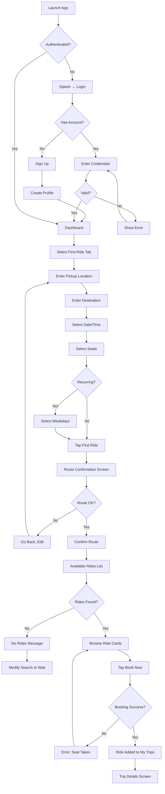

### 3.2 Employee — Offer a Ride

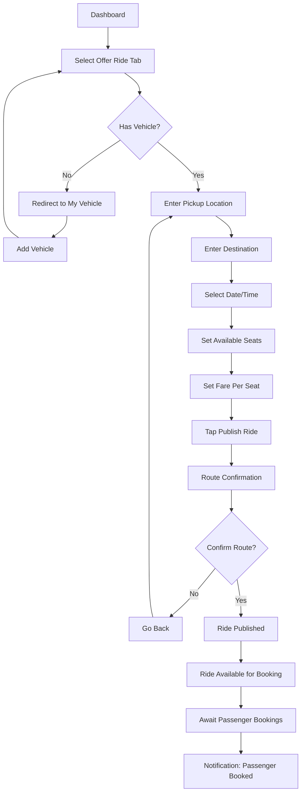

### 3.3 Employee — Active Trip Flow (Passenger)

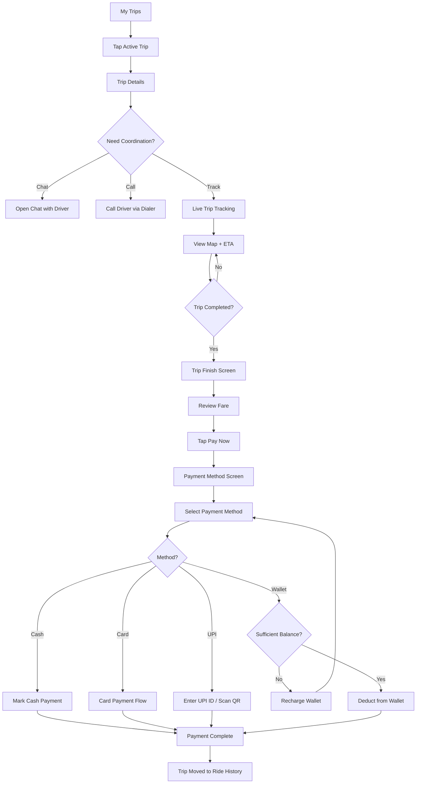

### 3.4 Employee — Active Trip Flow (Driver)

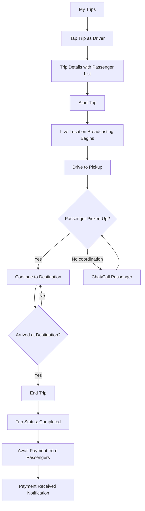

### 3.5 Administrator — Manage Organization

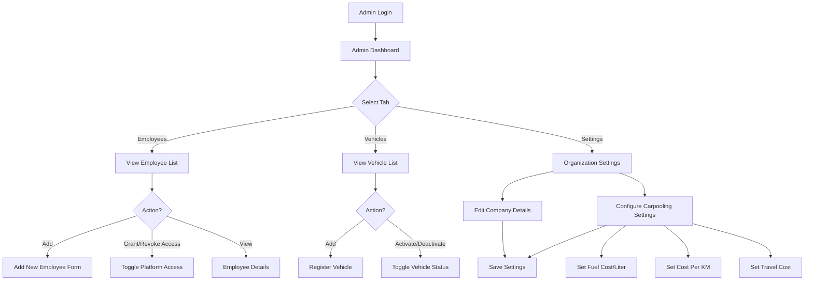

### 3.6 Failure Scenarios

| Scenario | User Type | Flow |
|---|---|---|
| **Network offline during booking** | Passenger | Queue booking → Show "Will book when online" → Sync on reconnect |
| **Payment gateway timeout** | Passenger | Show retry dialog → Allow method change → Manual retry |
| **GPS unavailable during tracking** | Both | Show last known position → Warning banner → Retry GPS acquisition |
| **Session expired** | All | Redirect to Login → Preserve intended action → Resume after re-auth |
| **No rides match criteria** | Passenger | Show empty state → Suggest broadening search (different time/date) |
| **Vehicle not registered** | Driver | Block publish → Redirect to My Vehicle → Add vehicle first |
| **Duplicate booking attempt** | Passenger | Show "Already booked" error → Navigate to existing trip |
| **Concurrent seat booking** | Passengers | First successful booking wins → Others get "Seat no longer available" |

---

## PHASE 4 — SYSTEM DESIGN

### 4.1 Architecture Overview

**Clean Architecture with Feature-First Organization + MVVM/Riverpod**

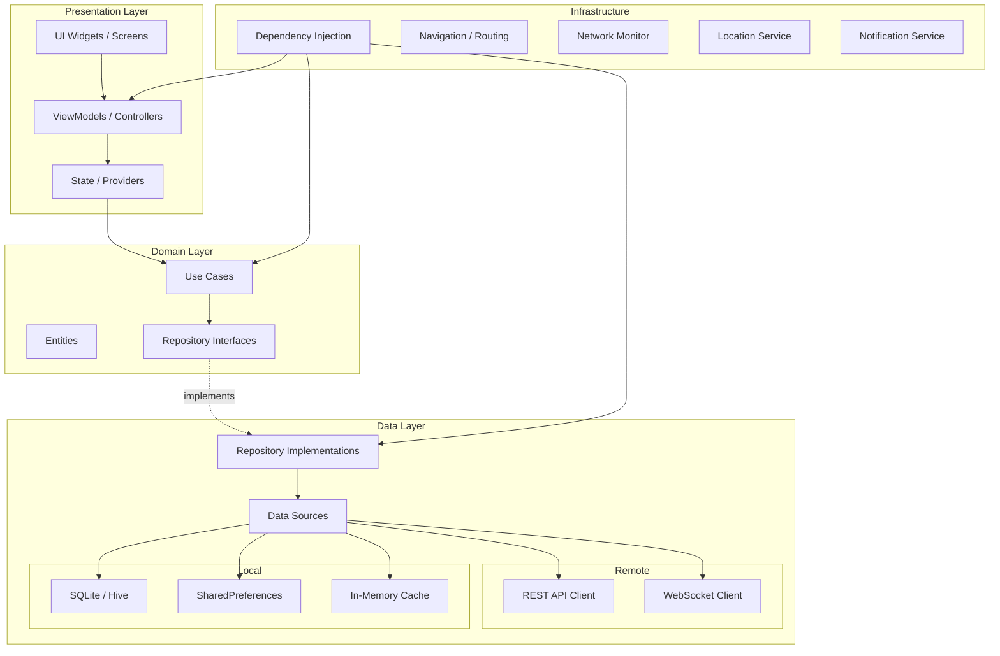

### 4.2 Why Clean Architecture?

| Decision | Rationale |
|---|---|
| **Clean Architecture** | Enforces separation of concerns; domain logic is independent of frameworks, UI, and databases. Each layer can be tested independently. |
| **Feature-First Structure** | Each feature is self-contained (screens + logic + data). Reduces merge conflicts in team development; makes features independently deployable. |
| **Repository Pattern** | Abstracts data sources; business logic doesn't know whether data comes from API, cache, or local DB. Enables offline-first capability. |
| **MVVM with Riverpod** | ViewModel holds presentation logic; Riverpod provides type-safe, testable, and composable state management with automatic disposal. |
| **Dependency Injection** | Riverpod itself serves as DI container. All dependencies are declared as providers, enabling easy mocking for tests. |

### 4.3 Offline Support Strategy

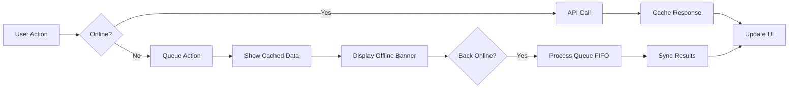

**Cacheable Data**: User profile, vehicles, trip history, saved places, wallet balance
**Queue-able Actions**: Booking requests, payment retries, profile updates
**Real-time Only**: Live tracking, chat (degrade gracefully when offline)

### 4.4 Caching Strategy

| Data Type | Cache Strategy | TTL | Storage |
|---|---|---|---|
| User Profile | Cache-first, background refresh | 1 hour | Hive |
| Vehicle List | Cache-first, invalidate on mutation | Until mutation | Hive |
| Ride Search Results | Network-only (always fresh) | None | Memory |
| Trip Details | Cache-first for completed; Network-first for active | 5 min (active) | Hive |
| Ride History | Cache-first, paginated | 30 min | Hive |
| Wallet Balance | Network-first | 1 min | Memory |
| Reports | Cache-first, background refresh | 1 hour | Hive |
| Saved Places | Cache-first | Until mutation | Hive |

### 4.5 Real-Time Communication

| Feature | Technology | Details |
|---|---|---|
| **Live Tracking** | WebSocket | Driver broadcasts GPS every 3s; passengers subscribe to ride channel |
| **Chat** | WebSocket | Persistent connection per ride; store messages locally + sync |
| **Notifications** | FCM/APNs | Booking confirmations, trip status changes, payment reminders |
| **Presence** | WebSocket heartbeat | Driver online/offline status |

### 4.6 Error Handling & Retry Strategy

```
Retry Policy:
  - Max retries: 3
  - Backoff: Exponential (1s, 2s, 4s)
  - Jitter: ±500ms
  - Retry on: 5xx, timeout, network error
  - Don't retry: 4xx (client errors)

Error Classification:
  - Recoverable: Network timeout, server error → auto-retry + user notification
  - Non-recoverable: Auth expired → redirect to login
  - Validation: 422 → show field-level errors
  - Business: 409 (seat conflict) → show user-friendly message + refresh
```

### 4.7 Authentication & Authorization

| Aspect | Implementation |
|---|---|
| **Auth Method** | JWT (Access + Refresh tokens) |
| **Access Token TTL** | 15 minutes |
| **Refresh Token TTL** | 30 days |
| **Token Storage** | Flutter Secure Storage (encrypted keychain) |
| **Auth Flow** | Login → JWT pair → Attach access token to all API calls → Auto-refresh on 401 |
| **Role-Based Access** | Token contains role claim (admin/employee); backend validates per endpoint |
| **Organization Scope** | Token contains org_id claim; all queries scoped to organization |

### 4.8 Security

| Measure | Implementation |
|---|---|
| **Data in Transit** | HTTPS/TLS 1.3 for all API calls; WSS for WebSocket |
| **Data at Rest** | Sensitive data (tokens) in Secure Storage; non-sensitive in Hive (encrypted) |
| **Input Validation** | Client-side + server-side validation |
| **API Security** | Rate limiting, request signing, CORS |
| **Payment Security** | PCI-compliant Razorpay SDK handles card data; no card data stored locally |
| **Location Privacy** | Location shared only during active trips; cleared on trip completion |

---

## PHASE 5 — DATABASE DESIGN

### 5.1 ER Diagram

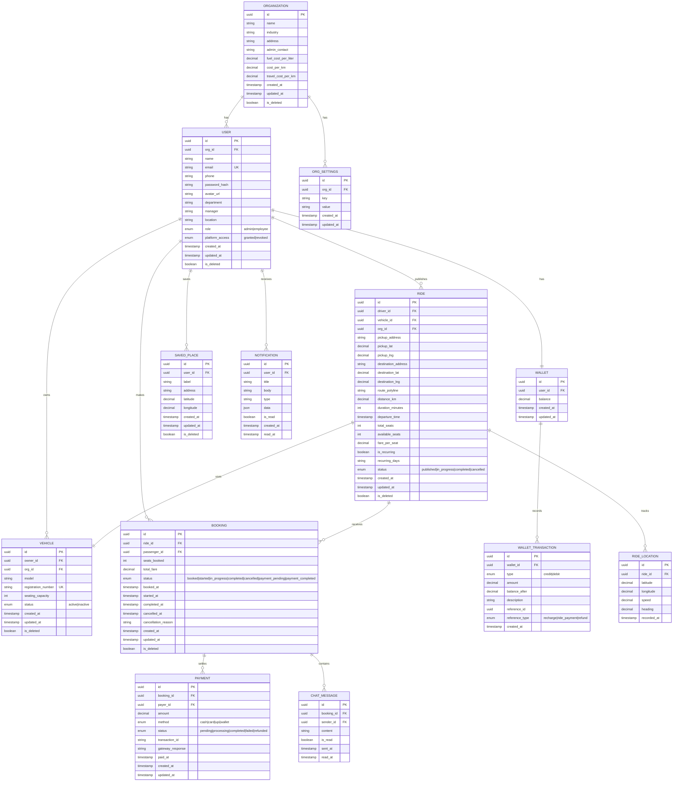

### 5.2 Key Indexes

| Table | Index | Columns | Purpose |
|---|---|---|---|
| `user` | `idx_user_org_email` | (org_id, email) | Login lookup, unique per org |
| `ride` | `idx_ride_search` | (org_id, status, departure_time, pickup_lat, pickup_lng) | Ride search query optimization |
| `ride` | `idx_ride_driver` | (driver_id, status) | Driver's active/published rides |
| `booking` | `idx_booking_passenger` | (passenger_id, status) | Passenger's trips |
| `booking` | `idx_booking_ride` | (ride_id, status) | Bookings per ride |
| `ride_location` | `idx_location_ride_time` | (ride_id, recorded_at DESC) | Latest location lookup |
| `wallet_transaction` | `idx_wallet_txn` | (wallet_id, created_at DESC) | Transaction history |
| `chat_message` | `idx_chat_booking` | (booking_id, sent_at) | Chat history per ride |
| `notification` | `idx_notif_user` | (user_id, is_read, created_at DESC) | Unread notifications |

### 5.3 Ride Lifecycle

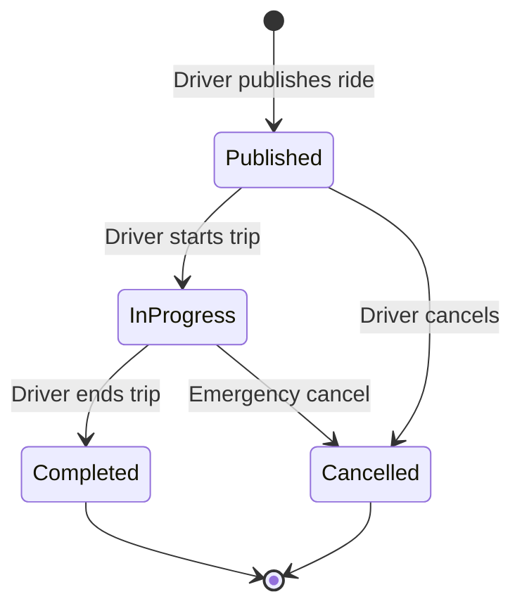

### 5.4 Payment Lifecycle

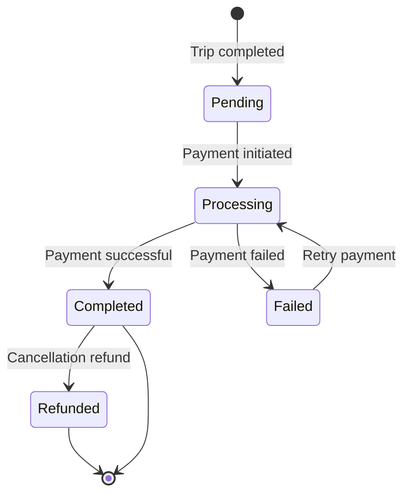

---

## PHASE 6 — API DESIGN

### 6.1 Authentication APIs

#### `POST /api/v1/auth/register`
```
Request:
{
  "name": "string (required)",
  "email": "string (required, email format)",
  "phone": "string (required, 10 digits)",
  "password": "string (required, min 6 chars)",
  "org_code": "string (required, organization invite code)",
  "avatar": "file (optional, multipart)"
}

Response (201):
{
  "user": { "id", "name", "email", "phone", "avatar_url", "role" },
  "access_token": "string",
  "refresh_token": "string"
}

Errors:
  409 - Email already registered
  422 - Validation errors
  404 - Invalid organization code
```

#### `POST /api/v1/auth/login`
```
Request:
{
  "email": "string (required)",
  "password": "string (required)"
}

Response (200):
{
  "user": { "id", "name", "email", "phone", "avatar_url", "role", "org_id" },
  "access_token": "string",
  "refresh_token": "string"
}

Errors:
  401 - Invalid credentials
  403 - Platform access revoked
```

#### `POST /api/v1/auth/refresh`
```
Request: { "refresh_token": "string" }
Response (200): { "access_token": "string", "refresh_token": "string" }
Errors: 401 - Invalid/expired refresh token
```

#### `POST /api/v1/auth/logout`
```
Headers: Authorization: Bearer {access_token}
Response (200): { "message": "Logged out successfully" }
```

---

### 6.2 Ride APIs

#### `POST /api/v1/rides`
**Publish a new ride (Driver)**
```
Request:
{
  "vehicle_id": "uuid (required)",
  "pickup": { "address": "string", "lat": number, "lng": number },
  "destination": { "address": "string", "lat": number, "lng": number },
  "departure_time": "ISO 8601 datetime",
  "total_seats": "int (1-7)",
  "fare_per_seat": "decimal",
  "is_recurring": "boolean",
  "recurring_days": ["MON","TUE","WED","THU","FRI"] (optional)
}

Response (201):
{
  "ride": { full ride object with route_polyline, distance_km, duration_minutes }
}

Errors:
  422 - Validation errors
  404 - Vehicle not found
  403 - Vehicle not owned by user
```

#### `GET /api/v1/rides/search`
**Search available rides (Passenger)**
```
Query Params:
  pickup_lat, pickup_lng (required)
  dest_lat, dest_lng (required)
  date (required, YYYY-MM-DD)
  time (optional, HH:mm)
  seats (required, int)
  radius_km (optional, default 3)

Response (200):
{
  "rides": [
    {
      "id", "driver": { "id", "name", "avatar_url" },
      "pickup", "destination",
      "departure_time", "available_seats", "fare_per_seat",
      "distance_km", "duration_minutes", "vehicle": { "model", "registration" }
    }
  ],
  "total": number
}
```

#### `POST /api/v1/rides/{ride_id}/book`
**Book a ride (Passenger)**
```
Request: { "seats": "int (required, ≥1)" }

Response (201):
{ "booking": { full booking object } }

Errors:
  409 - Insufficient seats available
  400 - Cannot book own ride
  404 - Ride not found
```

#### `PUT /api/v1/rides/{ride_id}/start`
**Start trip (Driver only)**
```
Response (200): { "ride": { status: "in_progress" } }
Errors: 403 - Not the driver; 400 - Ride not in published status
```

#### `PUT /api/v1/rides/{ride_id}/complete`
**Complete trip (Driver only)**
```
Response (200): { "ride": { status: "completed" } }
Errors: 403 - Not the driver; 400 - Ride not in_progress
```

#### `PUT /api/v1/rides/{ride_id}/cancel`
**Cancel ride**
```
Request: { "reason": "string (optional)" }
Response (200): { "ride": { status: "cancelled" } }
```

#### `GET /api/v1/rides/history`
**Ride history (paginated)**
```
Query: page, per_page, role (driver|passenger|all)
Response (200): { "rides": [...], "total", "page", "per_page" }
```

---

### 6.3 Vehicle APIs

#### `GET /api/v1/vehicles`
```
Response (200): { "vehicles": [{ "id", "model", "registration_number", "seating_capacity", "status" }] }
```

#### `POST /api/v1/vehicles`
```
Request: { "model": "string", "registration_number": "string", "seating_capacity": int }
Response (201): { "vehicle": {...} }
Errors: 409 - Registration number already exists
```

#### `PUT /api/v1/vehicles/{id}`
```
Request: { "model": "string", "seating_capacity": int, "status": "active|inactive" }
Response (200): { "vehicle": {...} }
```

#### `DELETE /api/v1/vehicles/{id}`
```
Response (200): { "message": "Vehicle removed" }
Errors: 400 - Vehicle has active rides
```

---

### 6.4 Payment APIs

#### `POST /api/v1/payments`
```
Request:
{
  "booking_id": "uuid",
  "method": "cash|card|upi|wallet",
  "upi_id": "string (if UPI)",
  "card_token": "string (if card, from Razorpay SDK)"
}

Response (200):
{ "payment": { "id", "status", "transaction_id", "amount" } }

Errors:
  400 - Invalid method
  402 - Insufficient wallet balance
  502 - Payment gateway error
```

---

### 6.5 Wallet APIs

#### `GET /api/v1/wallet`
```
Response (200): { "balance": decimal, "transactions": [...] }
```

#### `POST /api/v1/wallet/recharge`
```
Request: { "amount": decimal, "method": "card|upi", "upi_id": "string" }
Response (200): { "balance": decimal, "transaction": {...} }
```

---

### 6.6 Admin APIs

#### `GET /api/v1/admin/employees`
```
Query: page, per_page, search, department, access_status
Response (200): { "employees": [...], "total" }
```

#### `POST /api/v1/admin/employees`
```
Request: { "name", "email", "department", "manager", "location" }
Response (201): { "employee": {...} }
```

#### `PUT /api/v1/admin/employees/{id}/access`
```
Request: { "access": "granted|revoked" }
Response (200): { "employee": {...} }
```

#### `GET /api/v1/admin/vehicles`
```
Response (200): { "vehicles": [...] }
```

#### `PUT /api/v1/admin/vehicles/{id}/status`
```
Request: { "status": "active|inactive" }
Response (200): { "vehicle": {...} }
```

#### `GET /api/v1/admin/settings`
```
Response (200): { "company": {...}, "carpooling_config": {...} }
```

#### `PUT /api/v1/admin/settings`
```
Request: { "company_name", "industry", "address", "admin_contact", "fuel_cost_per_liter", "cost_per_km", "travel_cost_per_km" }
Response (200): { "settings": {...} }
```

---

### 6.7 Reports APIs

#### `GET /api/v1/reports/summary`
```
Query: period (monthly|quarterly|yearly)
Response: { "total_trips", "total_distance_km", "total_fuel_cost", "fleet_roi", "utilization_rate" }
```

#### `GET /api/v1/reports/financial`
```
Query: year
Response: { "months": [{ "month", "revenue", "fuel_cost", "maintenance", "net_profit" }] }
```

#### `GET /api/v1/reports/vehicle-cost`
```
Response: { "vehicles": [{ "vehicle", "trips", "distance", "cost" }] }
```

---

### 6.8 Chat & Notification APIs

#### `GET /api/v1/bookings/{booking_id}/messages`
```
Query: before (cursor), limit
Response: { "messages": [...], "has_more": boolean }
```

#### `POST /api/v1/bookings/{booking_id}/messages`
```
Request: { "content": "string" }
Response (201): { "message": {...} }
```

#### WebSocket: `wss://api.example.com/ws`
```
Events:
  - location_update: { ride_id, lat, lng, speed, heading, timestamp }
  - chat_message: { booking_id, sender_id, content, sent_at }
  - trip_status: { ride_id, status }
  - booking_notification: { type, data }
```

---

### 6.9 Global Error Codes

| Code | Meaning |
|---|---|
| 400 | Bad Request — Invalid input |
| 401 | Unauthorized — Missing/invalid token |
| 403 | Forbidden — Insufficient permissions |
| 404 | Not Found — Resource doesn't exist |
| 409 | Conflict — Duplicate/concurrent modification |
| 422 | Unprocessable Entity — Validation failure |
| 429 | Too Many Requests — Rate limited |
| 500 | Internal Server Error |
| 502 | Bad Gateway — External service failure |
| 503 | Service Unavailable — Maintenance |

---

## PHASE 7 — STATE MANAGEMENT

### 7.1 Global State (Riverpod Providers)

| Provider | Type | Scope | Purpose |
|---|---|---|---|
| `authProvider` | `StateNotifier<AuthState>` | App-wide | Auth tokens, user profile, login status |
| `userProvider` | `FutureProvider<User>` | App-wide | Current user profile |
| `walletProvider` | `StateNotifier<WalletState>` | App-wide | Wallet balance |
| `vehiclesProvider` | `StateNotifier<VehiclesState>` | App-wide | User's vehicles list |
| `activeTripsProvider` | `StateNotifier<TripsState>` | App-wide | Current active trips |
| `notificationProvider` | `StreamProvider<Notification>` | App-wide | Real-time notifications |
| `connectivityProvider` | `StreamProvider<ConnectivityStatus>` | App-wide | Network status |
| `orgSettingsProvider` | `FutureProvider<OrgSettings>` | Admin | Organization config |

### 7.2 Screen-Level State

| Screen | State | Type |
|---|---|---|
| Find Ride Form | Form values, validation errors | `StateProvider` / `StateNotifier` |
| Route Confirmation | Route polyline, distance, duration | `FutureProvider` (from Maps API) |
| Available Rides | Search results list | `AsyncNotifier` |
| Live Tracking | Vehicle position stream | `StreamProvider` (WebSocket) |
| Payment | Selected method, processing state | `StateNotifier` |
| Reports | Chart data, selected period | `FutureProvider` with family modifier |
| Admin Tables | Employee/vehicle lists with pagination | `AsyncNotifier` |

### 7.3 Caching with Riverpod

```dart
// Cache-first pattern using keepAlive + refresh
final rideHistoryProvider = AsyncNotifierProvider<RideHistoryNotifier, List<Ride>>(() {
  return RideHistoryNotifier();
});

// Invalidation on mutation
ref.invalidate(vehiclesProvider); // After add/edit/delete vehicle
```

### 7.4 Pagination Strategy

```
Pattern: Cursor-based pagination
- Each list provider maintains: items[], cursor, hasMore, isLoadingMore
- Load more triggered by scroll position (near end of list)
- New page appended to existing items
- Pull-to-refresh resets cursor and reloads from beginning
```

### 7.5 Optimistic Updates

| Action | Optimistic Behavior | Rollback on Failure |
|---|---|---|
| Book Ride | Immediately show in My Trips, decrement available seats | Remove from My Trips, restore seat count, show error |
| Send Chat | Immediately append to chat list with "sending" indicator | Mark as "failed", show retry button |
| Wallet Recharge | Show new balance immediately | Revert to previous balance, show error |
| Cancel Ride | Immediately update status to "cancelled" | Revert to previous status |

### 7.6 Offline Queue

```
Queue Structure: List<QueuedAction>
Each action: { id, type, payload, retryCount, createdAt, status }

Processing:
1. Monitor connectivity via StreamProvider
2. On reconnect → process queue FIFO
3. Each action: attempt API call → success: remove from queue → failure: increment retry → max 3
4. Store queue in Hive for persistence across app restarts
```

### 7.7 Real-Time Updates

```
WebSocket Connection Lifecycle:
1. Connect on app foreground + authenticated
2. Subscribe to user-specific channel on connect
3. Subscribe to ride-specific channels for active trips
4. Handle events: location_update, chat_message, trip_status, booking_notification
5. Reconnect with exponential backoff on disconnect
6. Unsubscribe from ride channels on trip completion
7. Disconnect on app background / logout
```

---

## PHASE 8 — PROJECT STRUCTURE

```
lib/
├── main.dart                          # App entry point, ProviderScope
├── app.dart                           # MaterialApp, routing, theming
│
├── core/                              # Shared infrastructure
│   ├── config/                        # Environment config, API URLs
│   │   ├── app_config.dart
│   │   └── env.dart
│   ├── constants/                     # App-wide constants
│   │   ├── api_constants.dart
│   │   ├── app_constants.dart
│   │   └── route_names.dart
│   ├── errors/                        # Error types & handling
│   │   ├── exceptions.dart
│   │   ├── failures.dart
│   │   └── error_handler.dart
│   ├── network/                       # HTTP & WebSocket clients
│   │   ├── api_client.dart            # Dio wrapper with interceptors
│   │   ├── api_interceptors.dart      # Auth, logging, error interceptors
│   │   ├── websocket_client.dart      # WebSocket management
│   │   └── network_info.dart          # Connectivity checker
│   ├── storage/                       # Local persistence
│   │   ├── secure_storage.dart        # Token storage
│   │   ├── hive_storage.dart          # Cached data
│   │   └── offline_queue.dart         # Offline action queue
│   ├── services/                      # Platform services
│   │   ├── location_service.dart      # GPS wrapper
│   │   ├── notification_service.dart  # FCM/local notifications
│   │   ├── navigation_service.dart    # GoRouter config
│   │   └── permission_service.dart    # Runtime permissions
│   ├── theme/                         # Design system
│   │   ├── app_theme.dart
│   │   ├── app_colors.dart
│   │   ├── app_typography.dart
│   │   └── app_spacing.dart
│   └── utils/                         # Shared utilities
│       ├── date_utils.dart
│       ├── currency_utils.dart
│       ├── validators.dart
│       └── extensions.dart
│
├── features/                          # Feature modules (feature-first)
│   ├── auth/                          # Authentication feature
│   │   ├── data/
│   │   │   ├── datasources/
│   │   │   │   ├── auth_remote_datasource.dart
│   │   │   │   └── auth_local_datasource.dart
│   │   │   ├── models/
│   │   │   │   ├── user_model.dart
│   │   │   │   └── auth_response_model.dart
│   │   │   └── repositories/
│   │   │       └── auth_repository_impl.dart
│   │   ├── domain/
│   │   │   ├── entities/
│   │   │   │   └── user.dart
│   │   │   ├── repositories/
│   │   │   │   └── auth_repository.dart
│   │   │   └── usecases/
│   │   │       ├── login.dart
│   │   │       ├── register.dart
│   │   │       └── logout.dart
│   │   └── presentation/
│   │       ├── providers/
│   │       │   └── auth_provider.dart
│   │       ├── screens/
│   │       │   ├── splash_screen.dart
│   │       │   ├── login_screen.dart
│   │       │   └── signup_screen.dart
│   │       └── widgets/
│   │           ├── login_form.dart
│   │           └── signup_form.dart
│   │
│   ├── ride/                          # Ride management feature
│   │   ├── data/
│   │   │   ├── datasources/
│   │   │   ├── models/
│   │   │   └── repositories/
│   │   ├── domain/
│   │   │   ├── entities/
│   │   │   │   ├── ride.dart
│   │   │   │   └── booking.dart
│   │   │   ├── repositories/
│   │   │   └── usecases/
│   │   │       ├── find_rides.dart
│   │   │       ├── publish_ride.dart
│   │   │       ├── book_ride.dart
│   │   │       └── cancel_ride.dart
│   │   └── presentation/
│   │       ├── providers/
│   │       ├── screens/
│   │       │   ├── dashboard_screen.dart
│   │       │   ├── find_ride_screen.dart
│   │       │   ├── offer_ride_screen.dart
│   │       │   ├── route_confirmation_screen.dart
│   │       │   └── available_rides_screen.dart
│   │       └── widgets/
│   │           ├── ride_card.dart
│   │           ├── location_input.dart
│   │           └── seat_selector.dart
│   │
│   ├── trip/                          # Trip management feature
│   │   ├── data/ ...
│   │   ├── domain/ ...
│   │   └── presentation/
│   │       ├── providers/
│   │       ├── screens/
│   │       │   ├── my_trips_screen.dart
│   │       │   ├── trip_details_screen.dart
│   │       │   ├── trip_finish_screen.dart
│   │       │   └── live_tracking_screen.dart
│   │       └── widgets/
│   │           ├── trip_card.dart
│   │           ├── tracking_map.dart
│   │           └── eta_indicator.dart
│   │
│   ├── payment/                       # Payments & Wallet
│   │   ├── data/ ...
│   │   ├── domain/ ...
│   │   └── presentation/
│   │       ├── screens/
│   │       │   ├── payment_method_screen.dart
│   │       │   └── wallet_screen.dart
│   │       └── widgets/
│   │
│   ├── vehicle/                       # Vehicle management
│   │   ├── data/ ...
│   │   ├── domain/ ...
│   │   └── presentation/
│   │       ├── screens/
│   │       │   ├── my_vehicles_screen.dart
│   │       │   └── add_vehicle_screen.dart
│   │       └── widgets/
│   │
│   ├── chat/                          # In-app chat
│   │   ├── data/ ...
│   │   ├── domain/ ...
│   │   └── presentation/
│   │
│   ├── history/                       # Ride history
│   │   ├── data/ ...
│   │   ├── domain/ ...
│   │   └── presentation/
│   │
│   ├── reports/                       # Reports & Analytics
│   │   ├── data/ ...
│   │   ├── domain/ ...
│   │   └── presentation/
│   │
│   ├── settings/                      # Settings & Saved Places
│   │   ├── data/ ...
│   │   ├── domain/ ...
│   │   └── presentation/
│   │
│   └── admin/                         # Admin dashboard
│       ├── data/ ...
│       ├── domain/ ...
│       └── presentation/
│           ├── screens/
│           │   └── admin_dashboard_screen.dart
│           └── widgets/
│               ├── employees_tab.dart
│               ├── vehicles_tab.dart
│               └── settings_tab.dart
│
├── shared/                            # Shared UI components
│   ├── widgets/
│   │   ├── app_bar.dart
│   │   ├── bottom_nav.dart
│   │   ├── loading_indicator.dart
│   │   ├── error_widget.dart
│   │   ├── empty_state.dart
│   │   ├── map_widget.dart
│   │   └── confirm_dialog.dart
│   └── mixins/
│       ├── form_validation_mixin.dart
│       └── loading_mixin.dart
│
└── generated/                         # Auto-generated (JSON serialization, etc.)
```

### Why Each Top-Level Folder Exists

| Folder | Rationale |
|---|---|
| `core/` | Infrastructure code shared across ALL features. Framework-agnostic utilities. |
| `features/` | **Feature-first** organization. Each feature is a mini-application with its own data/domain/presentation layers. Team members can work on different features in parallel. |
| `shared/` | Reusable UI components that span multiple features (bottom nav, map widget, dialogs). |
| `generated/` | Auto-generated code (build_runner output). Kept separate to avoid clutter. |

---

## PHASE 9 — DEVELOPMENT ROADMAP

### Milestone 1: Foundation & Authentication (Hours 1-4)

| Task | Complexity | Risk | Dependencies |
|---|---|---|---|
| Project setup (Flutter + dependencies) | Low | Low | None |
| Core infrastructure (API client, storage, DI) | Medium | Low | None |
| Design system (theme, colors, typography) | Low | Low | None |
| Splash Screen | Low | Low | Theme |
| Login Screen + API | Medium | Low | Core |
| Sign Up Screen + API | Medium | Low | Core |
| Navigation setup (GoRouter) | Medium | Low | Auth |
| Auth state management | Medium | Medium | Core |

**Deliverable**: User can register, login, and see Dashboard shell.

---

### Milestone 2: Ride Discovery & Publishing (Hours 4-8)

| Task | Complexity | Risk | Dependencies |
|---|---|---|---|
| Dashboard screen (Find/Offer tabs) | Medium | Low | M1 |
| Location input with autocomplete | High | Medium | Maps API |
| Route Confirmation screen with map | High | Medium | Maps API |
| Find Ride search API integration | Medium | Low | M1 |
| Available Rides list screen | Medium | Low | M1 |
| Ride booking flow | Medium | Medium | Available Rides |
| Offer Ride form + publish | Medium | Low | M1 |
| Bottom navigation bar | Low | Low | M1 |

**Deliverable**: Complete Find Ride → Book and Offer Ride → Publish flows.

---

### Milestone 3: Trip Management & Live Tracking (Hours 8-13)

| Task | Complexity | Risk | Dependencies |
|---|---|---|---|
| My Trips list screen | Medium | Low | M2 |
| Trip Details screen | Medium | Low | M2 |
| Trip lifecycle state machine | High | Medium | M2 |
| Live Tracking screen with map | High | High | WebSocket, Maps |
| WebSocket integration for location | High | High | Backend WS |
| Location broadcasting (driver) | High | Medium | GPS service |
| ETA calculation & display | Medium | Medium | Maps API |
| Trip Finish screen | Low | Low | M3 |
| Chat integration (basic) | Medium | Medium | WebSocket |
| Call to Driver (phone intent) | Low | Low | M3 |

**Deliverable**: Full trip lifecycle from booking to completion with live tracking.

---

### Milestone 4: Payments, Wallet & Vehicle (Hours 13-17)

| Task | Complexity | Risk | Dependencies |
|---|---|---|---|
| Payment Method screen | Medium | Medium | M3 |
| Cash payment flow | Low | Low | Payment screen |
| UPI payment integration | Medium | Medium | Razorpay SDK |
| Card payment integration | Medium | Medium | Razorpay SDK |
| Wallet screen | Medium | Low | M1 |
| Wallet recharge flow | Medium | Medium | Razorpay SDK |
| Wallet payment deduction | Medium | Low | Wallet |
| My Vehicle screen | Medium | Low | M1 |
| Add/Edit/Delete vehicle | Medium | Low | My Vehicle |
| Vehicle validation for ride publishing | Low | Low | M2 + Vehicle |

**Deliverable**: Complete payment flows, wallet management, vehicle CRUD.

---

### Milestone 5: History, Reports, Settings & Admin (Hours 17-21)

| Task | Complexity | Risk | Dependencies |
|---|---|---|---|
| Ride History screen | Medium | Low | M3 |
| Reports Dashboard (charts) | High | Medium | Data from M3/M4 |
| Financial summary table | Medium | Low | Reports API |
| Settings screen | Low | Low | M1 |
| Saved Places CRUD | Medium | Low | M1 |
| Admin Dashboard - Employees tab | Medium | Low | M1 |
| Admin Dashboard - Vehicles tab | Medium | Low | M1 |
| Admin Dashboard - Settings tab | Medium | Low | M1 |
| Admin access control | Medium | Low | Auth |

**Deliverable**: All remaining screens functional.

---

### Milestone 6: Polish, Testing & Bonus Features (Hours 21-24)

| Task | Complexity | Risk | Dependencies |
|---|---|---|---|
| Push notifications | Medium | Medium | FCM setup |
| Ride cancellation flow | Medium | Low | M3 |
| Error handling polish | Medium | Low | All |
| Loading/empty/error states for all screens | Medium | Low | All |
| UI polish and animations | Medium | Low | All |
| End-to-end workflow testing | High | Medium | All |
| Bug fixes from testing | Variable | Medium | All |
| Demo preparation | Low | Low | All |

**Deliverable**: Production-quality demo-ready application.

---

## PHASE 10 — TECH STACK DECISION

### Flutter vs React Native — Detailed Comparison

| Criterion | Flutter | React Native | Winner |
|---|---|---|---|
| **Performance** | Compiled to native ARM; Skia/Impeller rendering engine; no JS bridge | JS bridge for native modules; new architecture (Fabric/TurboModules) improves but still interpreted | **Flutter** |
| **Architecture** | Clean Architecture + Riverpod is mature, well-documented pattern | Similar patterns possible but less standardized ecosystem | **Flutter** |
| **UI Complexity** | Custom render engine; pixel-perfect control; Material + Cupertino widgets | Relies on native components; custom UI requires native bridges | **Flutter** |
| **Maps Integration** | `google_maps_flutter` — official, well-maintained, custom markers | `react-native-maps` — good but occasional native build issues | **Tie** |
| **Real-time Tracking** | Excellent WebSocket + GPS support; background location reliable | Good WebSocket; background location requires native modules | **Flutter** |
| **Animations** | Built-in animation framework; Rive/Lottie support; smooth 60fps | Reanimated 2 is excellent but complex setup | **Flutter** |
| **Native Integrations** | Platform channels (simple); growing FFI support | Native modules; Turbo Modules (improving) | **Tie** |
| **Developer Productivity** | Hot reload is industry-leading; strong typing with Dart | Fast Refresh; familiar JS/TS ecosystem | **Flutter** (slight edge) |
| **Maintenance** | Single codebase, single language (Dart), predictable upgrades | JS/TS ecosystem churn; dependency hell risk | **Flutter** |
| **Testing** | Widget tests + integration tests + golden tests built-in | Jest + Detox; more setup required | **Flutter** |
| **Scalability** | Proven at scale (Google Pay, BMW, Alibaba) | Proven at scale (Facebook, Instagram, Shopify) | **Tie** |
| **State Management** | Riverpod is type-safe, composable, excellent for this architecture | Redux Toolkit / Zustand — good but less cohesive | **Flutter** |
| **Package Ecosystem** | Growing; all required packages exist (maps, payments, charts) | Larger ecosystem but quality varies | **Tie** |

### Decision: **Flutter**

**Technical Justification:**

1. **Performance-critical features**: Live GPS tracking with map rendering at 60fps, real-time location updates via WebSocket, and smooth map animations are core to this app. Flutter's compiled-to-native architecture with Skia/Impeller gives a measurable performance advantage over React Native's bridge-based architecture for these use cases.

2. **Pixel-perfect UI control**: The mockups show custom UI elements (ride cards, map overlays, wallet UI) that benefit from Flutter's custom rendering engine rather than depending on native component bridges.

3. **Clean Architecture fit**: Riverpod as both state management and DI container is a natural fit for Clean Architecture with MVVM. The pattern is well-established in the Flutter community with extensive documentation and examples.

4. **Maps & Location**: `google_maps_flutter` + `geolocator` + `flutter_polyline_points` provide a battle-tested stack for the maps-heavy features.

5. **Payment Integration**: Razorpay provides a first-class Flutter SDK with test mode support.

6. **Single developer/small team efficiency**: Dart's type system catches errors at compile time; hot reload enables rapid iteration; no native build system complexity.

---

## PHASE 11 — FINAL REPORT

### System Overview Diagram

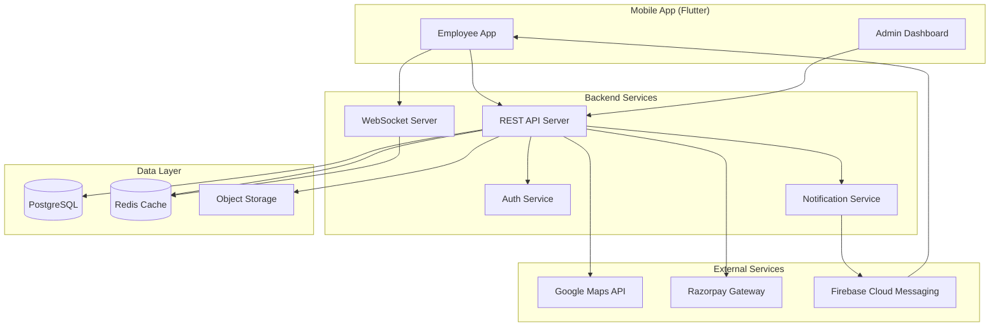

### Data Flow — Ride Booking

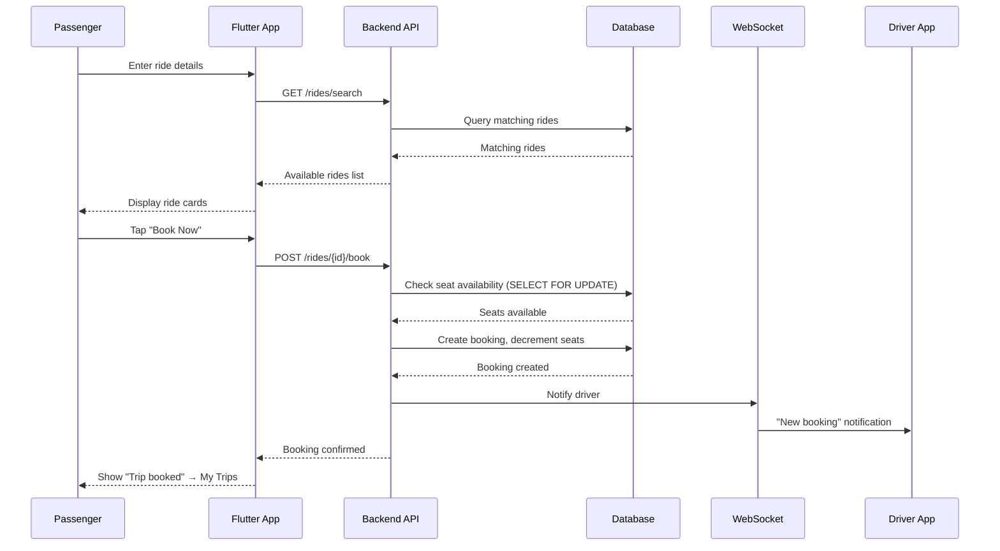

### Feature Matrix

| Feature | Employee (Find) | Employee (Offer) | Admin | Priority |
|---|---|---|---|---|
| Registration/Login | ✅ | ✅ | ✅ | P0 |
| Find Ride | ✅ | — | — | P0 |
| Offer Ride | — | ✅ | — | P0 |
| Route Confirmation | ✅ | ✅ | — | P0 |
| Book Ride | ✅ | — | — | P0 |
| My Trips | ✅ | ✅ | — | P0 |
| Live Tracking | ✅ | ✅ | — | P0 |
| Chat | ✅ | ✅ | — | P1 |
| Call | ✅ | ✅ | — | P1 |
| Payment | ✅ | — | — | P0 |
| Wallet | ✅ | ✅ | — | P0 |
| My Vehicle | — | ✅ | — | P0 |
| Ride History | ✅ | ✅ | — | P0 |
| Reports | ✅ | ✅ | ✅ | P0 |
| Settings | ✅ | ✅ | — | P0 |
| Saved Places | ✅ | ✅ | — | P1 |
| Employee Mgmt | — | — | ✅ | P0 |
| Vehicle Mgmt | — | — | ✅ | P0 |
| Org Settings | — | — | ✅ | P0 |
| Push Notifications | ✅ | ✅ | — | P1 (Bonus) |
| Ride Cancellation | ✅ | ✅ | — | P1 (Bonus) |

### Risk Analysis

| Risk | Probability | Impact | Mitigation |
|---|---|---|---|
| Maps API quota exceeded | Medium | High | Implement caching for geocoding; use OpenStreetMap as fallback |
| WebSocket unreliable | Medium | High | Fallback to polling every 5s; store last known location |
| Razorpay integration issues | Low | Medium | Implement cash-first; add payment gateway later |
| GPS accuracy issues | Medium | Medium | Use fused location provider; show accuracy radius on map |
| Concurrent booking race condition | Medium | High | Optimistic locking with version column; SELECT FOR UPDATE |
| 24-hour time constraint | High | High | Prioritize P0 features; defer bonus features; use scaffolding |
| Backend unavailability | Low | Critical | Offline queue; graceful degradation; cached data |

### Testing Strategy

| Level | Tool | Scope |
|---|---|---|
| **Unit Tests** | `flutter_test` | Use cases, repositories, providers, utilities |
| **Widget Tests** | `flutter_test` | Individual screens, forms, cards |
| **Integration Tests** | `integration_test` | Full user flows (login → book → pay) |
| **API Tests** | Postman / Thunder Client | All endpoints with valid/invalid payloads |
| **Manual Testing** | Device + Emulator | End-to-end workflow, GPS, payments |

### Deployment Strategy

| Environment | Purpose | Trigger |
|---|---|---|
| **Development** | Developer testing | Every push to `develop` |
| **Staging** | QA / Demo | Merge to `staging` |
| **Production** | End users | Tagged release from `main` |

### CI/CD Pipeline

```
Push → Lint → Analyze → Test (unit + widget) → Build (APK/IPA) → Deploy to Firebase App Distribution
```

### Monitoring & Logging

| Aspect | Tool | Purpose |
|---|---|---|
| **Crash Reporting** | Firebase Crashlytics | Runtime crashes, ANRs |
| **Analytics** | Firebase Analytics | User engagement, feature usage |
| **Performance** | Firebase Performance | API latency, screen render times |
| **Logging** | Structured logging (Logger) | Debug logs with severity levels |
| **Backend Monitoring** | Prometheus + Grafana | API health, response times, error rates |

### Scalability Path

| Phase | Scale | Approach |
|---|---|---|
| **v1 (Hackathon)** | Single org, ~100 users | Monolithic backend, single DB |
| **v2** | Multi-org, ~10K users | Microservices decomposition, read replicas |
| **v3** | Enterprise, ~100K users | Event-driven architecture, CQRS, geo-sharding |

### Future Improvements (Post-Hackathon)

1. **Intelligent Ride Matching** — ML-based matching considering route overlap, schedule compatibility, user preferences
2. **Route Optimization** — Multi-stop rides, optimal pickup ordering
3. **Rating & Review System** — Post-ride ratings for trust building
4. **Carbon Footprint Dashboard** — Environmental impact visualization
5. **SSO Integration** — Corporate SAML/OIDC for enterprise auth
6. **Multi-language Support** — i18n/l10n
7. **Accessibility** — Screen reader support, high contrast mode
8. **Offline Maps** — Downloadable map tiles for areas with poor connectivity
9. **Ride Scheduling** — Book rides days/weeks in advance with guaranteed matching
10. **Cost Splitting** — Automatic fare splitting between co-passengers

---

## Open Questions

> [!IMPORTANT]
> **These questions need your input before development begins:**

1. **Backend Technology**: Should we build the backend with Node.js (Express/Fastify), Python (FastAPI), or use a BaaS like Firebase/Supabase? This affects the 24-hour timeline significantly.

2. **Maps Provider**: Google Maps (richer features, requires API key + billing) vs OpenStreetMap (free, self-hostable)? The mockups show Google Maps-style UI.

3. **Admin Dashboard**: Should the admin interface be a web app (as shown in mockups — desktop layout) or embedded within the same Flutter app with responsive layout?

4. **Chat Depth**: Should we implement full-featured in-app chat (message history, read receipts) or a simplified one-way notification-style messaging?

5. **Recurring Rides**: Should recurring rides auto-create future ride instances, or just repeat the search criteria?

6. **Demo Data**: Should we pre-seed the database with sample organizations, employees, vehicles, and rides for the demo?

> [!WARNING]
> The 24-hour constraint means we must make ruthless priority decisions. Bonus features should only be attempted after all P0 features pass end-to-end testing.
